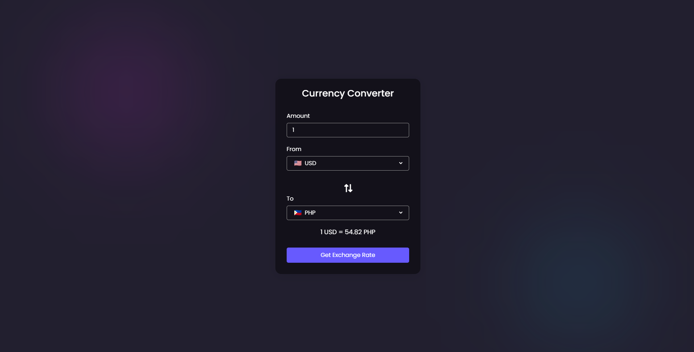

# Currency Converter

A simple currency converter web application built using HTML, CSS, and JavaScript. The app allows users to convert currencies with real-time exchange rates fetched from an API. It features a user-friendly interface with options to select the source currency, target currency, and input amount for conversion.

**[View Live Demo](https://shinaylim.github.io/currency-converter-api/)**

**Features**
- Real-time exchange rate updates.
- Support for multiple currencies from around the world.
- Intuitive user interface with easy currency selection.
- Input amount to get instant conversion results.

**Usage**
1. Enter the amount you want to convert in the "Amount" input box.
2. Select the currency you want to convert from using the "From" dropdown.
3. Select the target currency you want to convert to using the "To" dropdown.
4. Click the "Get Exchange Rate" button to calculate the conversion.
5. The converted amount will be displayed in the "Result" section.

**How to Run**
1. Clone or download the repository.
2. Open index.html in your web browser.
3. Start converting currencies and exploring exchange rates!

**Contributing**

Feel free to use, modify, and contribute to this project. Feedback and suggestions are always welcome. To contribute, follow these steps:

1. Fork the repository.
2. Create your feature branch: git checkout -b feature/my-feature.
3. Commit your changes: git commit -am 'Add some feature'.
4. Push the branch: git push origin feature/my-feature.
5. Create a pull request.
   
**Credits**

- Font Awesome for the awesome icons.
- FlagCDN for the country flag images.
  
**License**

This project is licensed under the MIT License.

For more details, please check the project source code in the index.js and style.css files.

